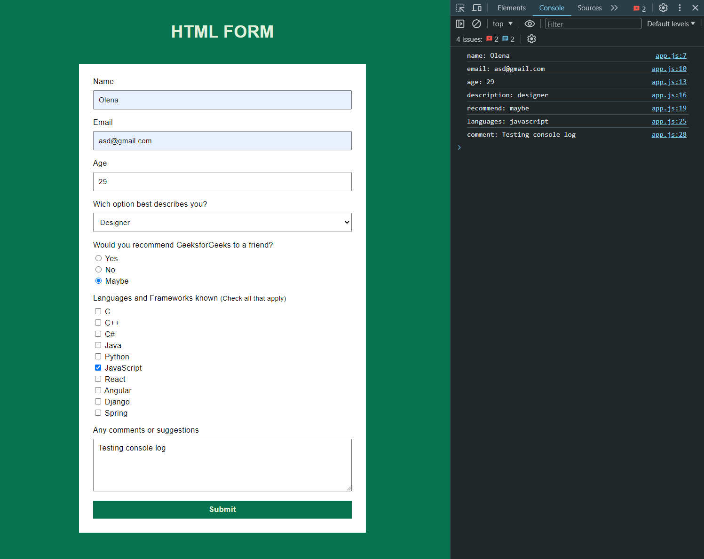

# HTML-Form
Homework for the Full Stack Web Development course from https://factoriaf5.org. Practice creating a form in HTML and CSS, and add a console log in JS as an extra task.

## Preview:


## Install
```bash
git clone https://github.com/OlenaAndrushchenko/HTML-Form.git
```

## Stack
- HTML
- CSS
- JavaScript